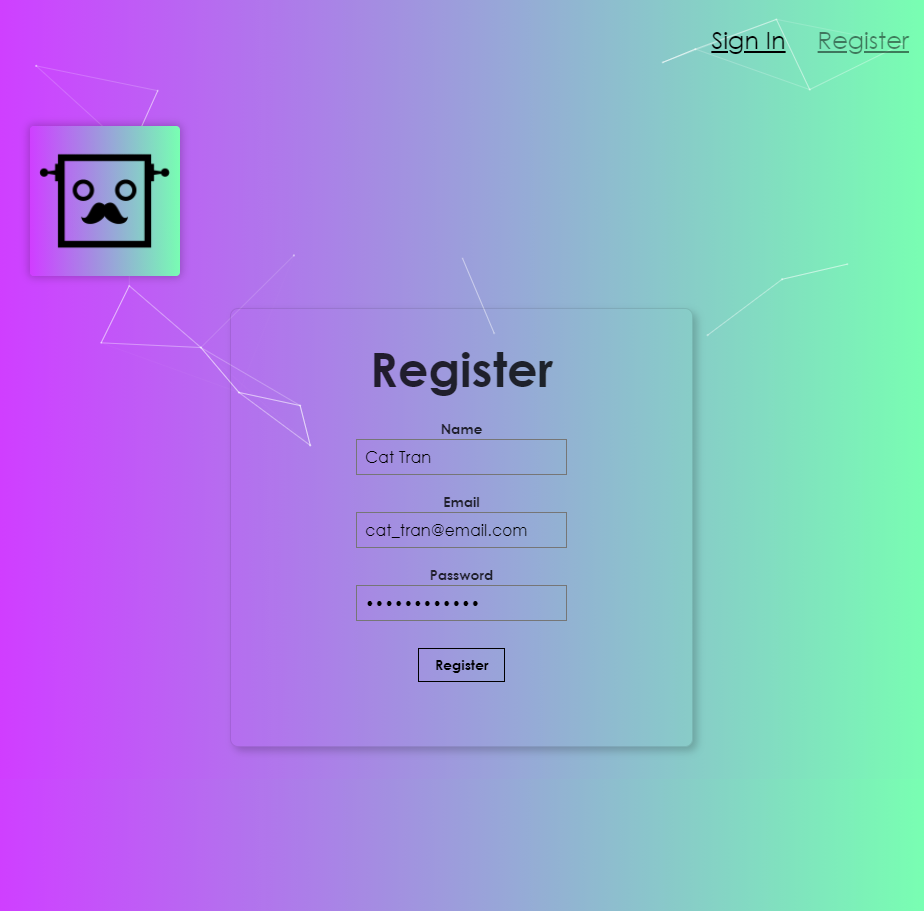

# Face Recognition Web

- A face recognition web application that recognizes faces in any image url you put in.
- Users can register an account and sign in to use the app to keep track of the total entries the user got (as like a score). 
- The application was developed using React JS, Express JS and the Clarifai API. The server and database (PostgeSQL) was deployed using Heroku.

<h1>Home Screen </h1>

- Right click on the image that you want to use
- Select "Open image in new tab"
- Then copy the URL and pasta them in the box

<h1>Register Screen </h1>

- The password are hashed and store securely
- You don't have to verify your email to make things easier

